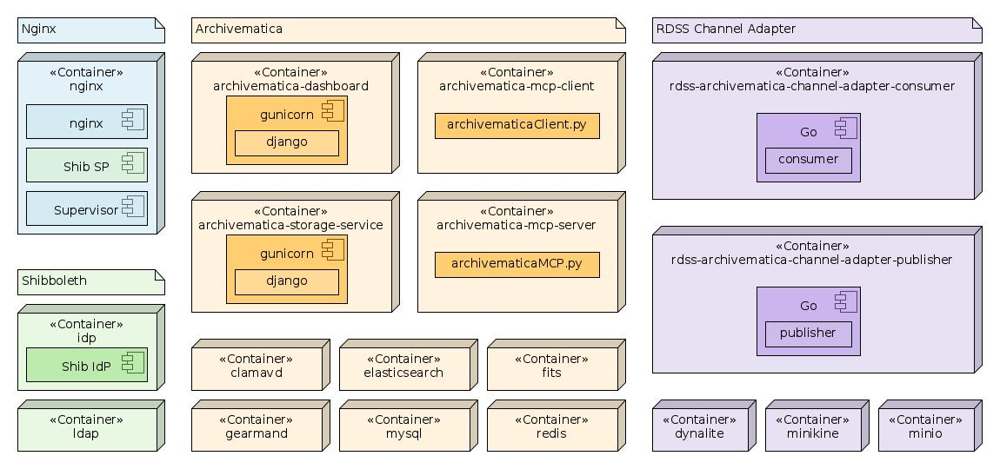

Docker-Compose Services
========================

We use `docker-compose` to orchestrate multiple services so that together they combine to provide Archivematica and supporting services, such as database backend, authentication, etc.

The following diagram gives an overview of the deployed service containers, grouped together to show how they are related logically.

In the above, the main Archivematica services are highlighted in orange. The services related to Shibboleth are in green, whilst the RDSS-specific containers are highlighted in purple. The nginx service that fronts it all is highlighted in blue. Where relevant the components deployed into each container are shown; for base services this is omitted.

Some of these containers are required for local development only. In a production deployment, the `dynalite`, `minikine` and `minio` containers would be replaced with connections to actual DynamoDB, Kinesis and S3 services in an AWS environment. Similarly, if the Shibboleth SP in the `nginx` container is configured to use an external IdP then the `idp` and `ldap` containers would become unnecessary.

Service Sets
-------------

There are currently three service sets defined:

1. [dev](dev), which defines the main Archivematica services and supporting web server, db, etc, suitable for use in a development environment.
1. [example-shib](example-shib), which demonstrates Shibboleth integration, providing two demo applications, and Shibboleth Service Providers (SP) and an Identity Provider (IdP) with backing LDAP service.
1. [am-shib](am-shib), which wraps the Archivematica services in the [dev](dev) service set in Shibboleth authentication, with an integrated SP and example IdP.

These service sets are defined by [docker-compose.dev.yml](docker-compose.dev.yml), [docker-compose.example-shib.yml](docker-compose.example-shib.yml) and [docker-compose.am-shib.yml](docker-compose.am-shib.yml), respectively. You can use the [COMPOSE_FILE](https://docs.docker.com/compose/reference/envvars/) environment variable to set which `docker-compose` file or files you wish to use.

To just configure the Archivematica dev environment, use

	COMPOSE_FILE=docker-compose.dev.yml docker-compose <compose-args>

To configure Archivematica with Shibboleth authentication, use

	COMPOSE_FILE=docker-compose.dev.yml:docker-compose.am-shib.yml docker-compose <compose-args>

There are also Makefiles defined that shortcut some of this for you, for example:

	make all SHIBBOLETH_CONFIG=archivematica

This will set `COMPOSE_FILE=docker-compose.dev.yml:docker-compose.am-shib.yml` when calling `docker-compose` as part of the build process.

In general it is recommended to use the `make` commands rather than call `docker-compose` directly for building, as there are a number of additional tasks that need to be done other than `docker-compose build`.

The exception to this is when using existing container instances. For example:

	COMPOSE_FILE=docker-compose.dev.yml:docker-compose.am-shib.yml docker-compose up -d --force-recreate --no-deps nginx

This will set the right `COMPOSE_FILE` context whilst allowing you to redeploy the `nginx` service, without having to do a full teardown-and-rebuild that `make all` would do.

Service Details
----------------

Details of the services deployed for each service set are in the README for that service set.

* [Archivematica Services](dev/README.md)
* [Shibboleth-enabled Archivematica Services](am-shib/README.md)
* [Example Shibboleth Services](example-shib/README.md)

There are also some service containers that are common to the `am-shib` and `example-shib` service sets, which are in the [shib](shib) folder. These have their own [README](shib/README.md) too, and their use is further described in the `am-shib` and `example-shib` READMEs.

Building
---------

To build all containers required to bring up a development version of Archivematica, use

	make all

This will create all the services defined in [docker-compose.dev.yml](docker-compose.dev.yml), which is symlinked by [docker-compose.yml](docker-compose.yml). There is no Shibboleth integration in this usage, so if you're not interested in Shibboleth, use this.

To enable Shibboleth integration, use

	make all SHIBBOLETH_CONFIG=archivematica

This will include additional services defined in [docker-compose.am-shib.yml](docker-compose.am-shib.yml) in addition to those in [docker-compose.dev.yml](docker-compose.dev.yml).

If you want to focus on just the Shibboleth services and aren't concerned with Archivematica, use

	make all SHIBBOLETH_CONFIG=example

This will bring up the services defined in [docker-compose.example-shib.yml](docker-compose.example-shib.yml), without any Archivmatica services.

After a successful build of the Shibboleth-enabled Archivematica services you should find you have the following services listed by `make list`:

	              Name                             Command                             State                              Ports
	-----------------------------------------------------------------------------------------------------------------------------------------
	archivematica.example.ac.uk        /usr/local/bin/ep -v /etc/ ...     Up                                 127.0.4.1:443->443/tcp,
	                                                                                                         0.0.0.0:33791->80/tcp,
	                                                                                                         0.0.0.0:33790->8000/tcp,
	                                                                                                         127.0.4.1:8443->8443/tcp,
	                                                                                                         9090/tcp
	idp.example.ac.uk                  run-jetty.sh                       Up                                 127.0.2.1:443->4443/tcp,
	                                                                                                         8443/tcp
	rdss_archivematica-dashboard_1     /bin/sh -c /usr/local/bin/ ...     Up                                 8000/tcp
	rdss_archivematica-mcp-client_1    /bin/sh -c /src/MCPClient/ ...     Up
	rdss_archivematica-mcp-server_1    /bin/sh -c /src/MCPServer/ ...     Up
	rdss_archivematica-storage-        /bin/sh -c /usr/local/bin/ ...     Up                                 8000/tcp
	service_1
	rdss_clamavd_1                     /run.sh                            Up                                 3310/tcp
	rdss_dynalite_1                    dynalite --port 4567               Up                                 0.0.0.0:33783->4567/tcp
	rdss_elasticsearch_1               /docker-entrypoint.sh elas ...     Up                                 9200/tcp, 9300/tcp
	rdss_fits_1                        /usr/bin/fits-ngserver.sh  ...     Up                                 2113/tcp
	rdss_gearmand_1                    docker-entrypoint.sh --que ...     Up                                 4730/tcp
	rdss_ldap_1                        /container/tool/run                Up                                 389/tcp, 636/tcp
	rdss_minikine_1                    node ./minikine.js                 Up                                 0.0.0.0:33784->4567/tcp
	rdss_minio_1                       /usr/bin/docker-entrypoint ...     Up                                 0.0.0.0:33785->9000/tcp
	rdss_mysql_1                       docker-entrypoint.sh mysqld        Up                                 3306/tcp
	rdss_rdss-archivematica-channel-   go run main.go consumer            Up                                 0.0.0.0:33787->6060/tcp
	adapter-consumer_1
	rdss_rdss-archivematica-channel-   go run main.go publisher           Up                                 0.0.0.0:33786->6060/tcp
	adapter-publisher_1
	rdss_redis_1                       docker-entrypoint.sh --sav ...     Up                                 6379/tcp

Notice that the `idp.example.ac.uk`, `sp1.example.ac.uk` and `archivematica.example.ac.uk` have specific ports exposed on specific IP addresses. This is intentional: Shibboleth requires well-defined hostnames and ports to be used, which means that, because we want to expose port 443 on both the IdP and the nginx server we need to use different network interfaces, which in this instance we are doing on the loopback interface. For this to work, you'll need to add the following to your `/etc/hosts` file:

	127.0.2.1	idp.example.ac.uk
	127.0.3.1	sp1.example.ac.uk
	127.0.4.1	archivematica.example.ac.uk

If you wish to change these IP addresses (perhaps to bind to additional physical network interfaces or bridges etc), you can change them using the environment variables defined in the [.env](.env) file in this folder, which is used by `docker-compose` during the build.

You can also change the domain name, by setting the `DOMAIN_NAME` environment variable. This can be done in the [.env](.env) file, or on the command line:

	DOMAIN_NAME=my.edu make all SHIBBOLETH_CONFIG=archivematica

The above would cause all containers and services to use the `my.edu` domain instead, including LDAP records and SSL certificates. Remember to update `/etc/hosts` on the docker host if you used the example entries above, so that the domain names in the FQDN match too.

Other Commands
---------------

Here are some other `make` commands other than `make all` that may be useful when working with these`docker-compose` configurations. These are designed to make it easier to ensure that the right context is available when using multiple configurations, such as when running with `SHIBBOLETH_CONFIG=archivematica`.

| Command | Description |
|---|---|
| `make destroy` | Tear down all the containers and clean build directories. |
| `make list` | List all running containers (using `docker-compose ps`) |
| `make watch` | Watch logs from all containers |
| `make watch-idp` | Watch logs from the [idp](shib/idp) container, if present |
| `make watch-idp` | Watch logs from the `nginx` container |
| `make watch-sp` | Watch logs from the [sp](example-shib/sp) container, if present (`example-shib` only) |

Remember to append the `SHIBBOLETH_CONFIG` argument to the above commands if `make all` was run with this set, otherwise the `docker-compose` context won't be resolved properly (this is required for the `watch-idp` and `watch-sp` commands).
